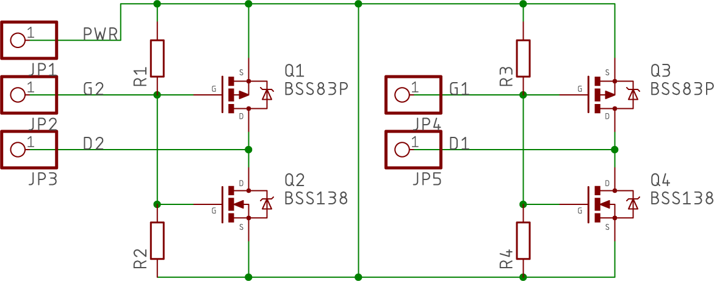
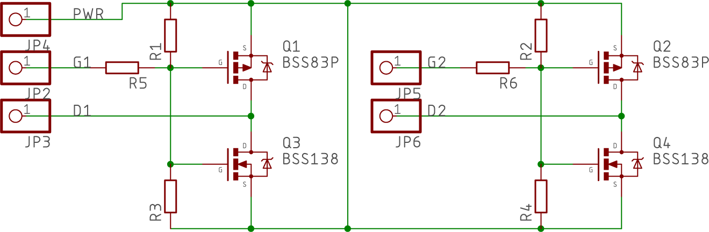

# Collection of SMD to breadboard adapters
When you manufature PCB in China, you usually have a space left over so why not fill it with some useful adapters!

## Dual N/P-MOSFET adapter
One side is for P-MOSFET ie.BSS83P includes pull-up resistor, the opposite is for N-MOSFET ie.BSS138 includes pull-down resistor *(can't operate simultaneously)* 

 

## Dual N/P-MOSFET adapter with gate resistor
One side is for P-MOSFET ie.BSS83P includes pull-up resistor, the opposite is for N-MOSFET ie.BSS138 includes pull-down resistor, both fitten with gate resistor *(can't operate simultaneously)* 

 

*PCBs done in Eagle 8*
