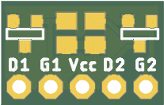
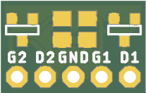

# Collection of SMD to breadboard adapters
When you manufature PCB in China, you usually have a space left over so why not fill it with some useful adapters!

## Dual N/P-MOSFET adapters
one side is for P-MOSFET, the opposite is for N-MOSFET *(can't operate simultaneously)*

*PCBs done in Eagle 8*