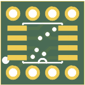
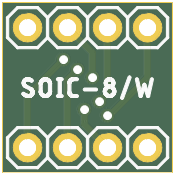

# Collection of SMD to breadboard adapters
When you manufature PCB in China, you usually have a space left over so why not fill it with some useful adapters!

## MSOP8/TSSOP8 adapter
 

## SOIC8/SOIC8W adapter
 

## SOIC14/SOIC14L adapter
 

## SOIC16/SOIC16L adapter
 

## SOIC18/SOIC18L adapter
 

## SOT-353/SOT-363 adapter
 

## RJ11 adapter
 

## RJ45 adapter
 

*PCBs done in Eagle 8*
